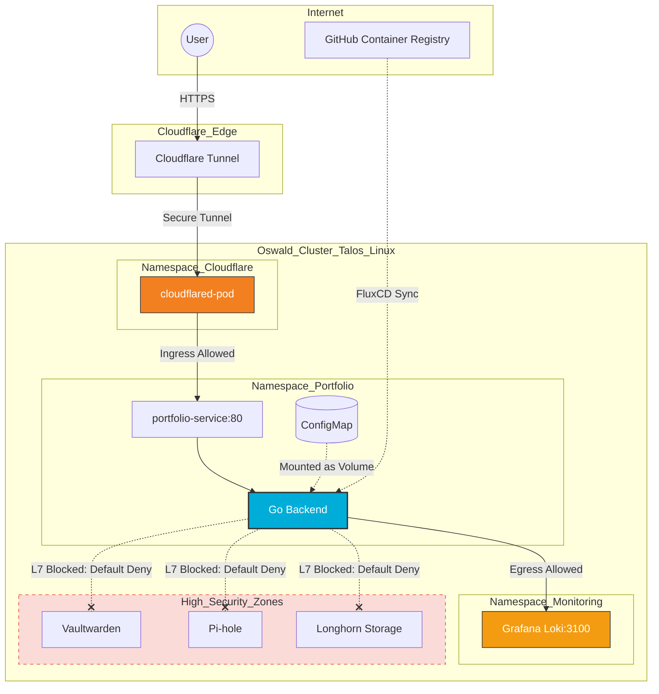

# Portfolio

## Overview

A high-performance, zero-distro portfolio built with **Go** and containerized using **Docker Scratch**. This project serves as a live demonstration of **GitOps** principles, utilizing **FluxCD** for continuous deployment and **Cilium** for eBPF-powered network security.

Built to showcase the entire application lifecycle, this portfolio prioritizes backend robustness and automated deployment over frontend fluff. It serves as a live demonstration of my ability to write efficient **Go** code, containerize it securely, and orchestrate it within a **Talos/FluxCD** environment with strict lateral movement protection.

## Architecture

- **Infrastructure:** Hosted at home within my bare metal Talos Linux cluster.
- **Orchestration:** Managed via Kubernetes with FluxCD for automated synchronization.
- **Networking:** Cilium provides identity-based security policies and L7 visibility via Hubble.
- **Observability:** Real-time GitOps logs are streamed directly from Grafana Loki.
- **Ingress:** Instead of exposing ports or using a standard LoadBalancer, this cluster utilizes `cloudflared`.
  -  **No Open Ports:** The tunnel creates an outbound-only connection to Cloudflare’s edge, making the cluster invisible to port scans.
  -  **DDoS Protection:** Leveraging Cloudflare's global edge network to absorb malicious traffic before it ever reaches the home network.

## Kubernetes Deployment

The deployment is split into three modular layers to ensure separation of concerns and ease of management via GitOps.

### **1:** The Content Layer [configmap.yaml](https://github.com/jonahgcarpenter/oswald-homelab/blob/master/clusters/production/portfolio/configmap.yaml)

Uses a Kubernetes ConfigMap to store portfolio data as Markdown files. This allows for "Database-less" content updates—simply edit the YAML in Git, and the Go backend automatically re-renders the UI via fsnotify.

### **2:** The Application Layer [deployment.yaml](https://github.com/jonahgcarpenter/oswald-homelab/blob/master/clusters/production/portfolio/deployment.yaml)

Defines the `portfolio` workload.

- **Security:** Runs as a non-root user (uid 1000) with a read-only root filesystem.
- **Efficiency:** Utilizes a 12MB scratch container image to minimize attack surface and resource footprint.

### **3:** The Network Layer [service.yaml](https://github.com/jonahgcarpenter/oswald-homelab/blob/master/clusters/production/portfolio/service.yaml) | [network-policy.yaml](https://github.com/jonahgcarpenter/oswald-homelab/blob/master/clusters/production/portfolio/network-policy.yaml)

Exposes the backend internally within the cluster. This Service is the target for the Cloudflare Tunnel, ensuring no ports are opened on my firewall.

To prevent lateral movement within the cluster, a CiliumNetworkPolicy is applied.

- **Ingress:** Restricted to traffic originating from the cloudflare-tunnel namespace (TBD).
- **Egress:** Locked down to only allow DNS resolution for the kube-dns service and HTTP traffic to the loki service in the monitoring namespace.

## CI/CD Pipeline

Automated builds are handled via GitHub Actions. Every new release triggers a multi-stage build that tags and pushes a new image to the GitHub Container Registry (GHCR).
